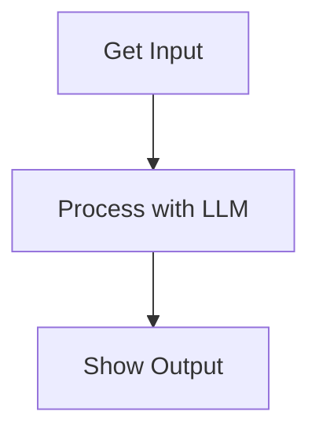

# PocketFlow Test Node Design

## Requirements
Simple demonstration of a PocketFlow node that:
- Takes user input
- Processes it through an LLM
- Shows the response
- Maintains proper separation of concerns

## Flow Design

### Applicable Design Pattern
Single Node Pattern - One regular node handles the entire interaction cycle.

### Flow Diagram


## Utility Functions

1. **Call LLM** (`utils/call_llm.py`)
   - Input: User's message
   - Output: LLM response
   - Used by test node to process user input

## Node Design

### Shared Memory
```python
shared = {
    "input": "",    # User's input message
    "response": ""  # LLM's response
}
```

### Node Steps

1. **TestNode**
   - *Purpose*: Process user input through LLM
   - *Type*: Regular Node (synchronous operation)
   - *Steps*:
     - *prep*: Read user input from shared store
     - *exec*: Call LLM with the input
     - *post*: Store response in shared store
