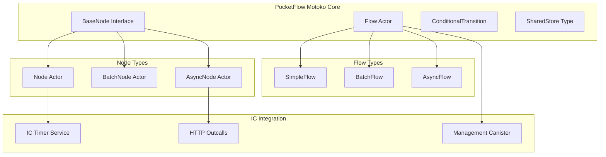

# PocketFlow to Motoko Port: Architecture & Implementation Plan

## Executive Summary

This plan outlines the port of PocketFlow's core workflow engine from Python to Motoko, targeting the Internet Computer ecosystem. The goal is to preserve the minimalist 100-line design while adapting it to leverage IC's actor model, inter-canister calls, and async capabilities.

## Core PocketFlow Analysis

Based on the `pocketflow/__init__.py` source, the library provides:

1. **Base Node System**: `BaseNode` with `prep()`, `exec()`, `post()` lifecycle
2. **Flow Orchestration**: `Flow` class managing node sequences via `successors`
3. **Conditional Transitions**: `_ConditionalTransition` for action-based routing
4. **Retry Logic**: `Node` with `max_retries` and `wait`
5. **Batch Processing**: `BatchNode` and `BatchFlow`
6. **Async Support**: `AsyncNode`, `AsyncFlow`, `AsyncParallelBatchNode`

## Internet Computer Architecture Considerations

### 1. Actor Model Integration
- **Canisters as Actors**: Each canister can host workflow engines or individual nodes
- **Inter-canister Communication**: Leverage async calls between canisters for distributed workflows
- **State Persistence**: Use stable variables for workflow state across upgrades

### 2. Async-First Design
- **Native Async**: Motoko's async/await aligns perfectly with PocketFlow's async patterns
- **Inter-canister Calls**: Natural fit for distributed node execution
- **Timer Integration**: Use IC timers for retry delays and scheduling

### 3. Memory & Performance
- **Heap Limits**: Design for IC's memory constraints (4GB heap limit)
- **Instruction Limits**: Optimize for IC's execution model
- **Stable Memory**: Leverage stable memory for large workflow data

## Motoko Implementation Architecture



## Core Type Definitions

### 1. Base Types
```motoko
type NodeId = Text;
type ActionName = Text;
type SharedStore = [(Text, Variant)]; // Flexible key-value store

type NodeResult<T> = {
    #success: T;
    #error: Text;
    #retry: Nat;
};

type Successor = {
    nodeId: NodeId;
    action: ?ActionName;
};
```

### 2. Node Interface
```motoko
type NodeInterface = {
    prep: (SharedStore) -> async Variant;
    exec: (Variant) -> async NodeResult<Variant>;
    post: (SharedStore, Variant, Variant) -> async ?ActionName;
    maxRetries: Nat;
    waitTime: Nat; // nanoseconds
};
```

### 3. Flow Configuration
```motoko
type FlowConfig = {
    startNode: NodeId;
    nodes: [(NodeId, NodeInterface)];
    successors: [(NodeId, ActionName, NodeId)];
};
```

## Implementation Strategy

### Phase 1: Core Engine (Target: ~100 lines)
1. **BaseNode Interface**: Define core node lifecycle methods
2. **Flow Orchestrator**: Implement sequential execution logic
3. **Conditional Transitions**: Support action-based routing
4. **Shared State**: Simple key-value store for inter-node communication

### Phase 2: IC Integration
1. **Timer Integration**: Use IC timers for retry delays
2. **Inter-canister Calls**: Enable distributed node execution
3. **State Persistence**: Stable variables for workflow state
4. **Upgrade Safety**: Handle canister upgrades gracefully

### Phase 3: Advanced Features
1. **Batch Processing**: Parallel execution within canisters
2. **HTTP Outcalls**: External API integration
3. **Monitoring**: Built-in observability and metrics
4. **Error Handling**: Comprehensive error recovery

## Cookbook Migration Strategy

### 1. Direct Ports (Minimal Changes)
- `hello-world`: Simple node/flow pattern
- `node`: Basic text processing
- `flow`: Interactive state transitions

### 2. IC-Enhanced Ports
- `map-reduce`: Leverage inter-canister parallelism
- `async-basic`: Use IC's async model
- `parallel-batch`: Distributed batch processing

### 3. IC-Native Reimplementations
- **Chat Examples**: Use IC's HTTP gateway and WebSocket-like patterns
- **API Integration**: Replace HTTP clients with IC HTTP outcalls
- **Data Processing**: Leverage stable memory for large datasets

## Candid Interface Design

### Core Workflow Service
```candid
type SharedStore = vec record { text; variant { text: text; nat: nat; bool: bool } };
type NodeResult = variant { success: text; error: text; retry: nat };

service : {
    // Core workflow operations
    create_flow: (text) -> (text);  // flow_name -> flow_id
    add_node: (text, text) -> ();   // flow_id, node_config
    run_flow: (text, SharedStore) -> (NodeResult);
    
    // Flow management
    get_flow_status: (text) -> (variant { running; completed; failed; paused });
    pause_flow: (text) -> ();
    resume_flow: (text) -> ();
    
    // Monitoring
    get_metrics: () -> (vec record { text; nat });
    get_logs: (text) -> (vec text);  // flow_id -> logs
};
```

### Node Service Interface
```candid
service : {
    // Node lifecycle
    prep: (SharedStore) -> (text);
    exec: (text) -> (NodeResult);
    post: (SharedStore, text, text) -> (opt text);
    
    // Configuration
    set_retry_config: (nat, nat) -> ();  // max_retries, wait_time
    get_config: () -> (record { max_retries: nat; wait_time: nat });
};
```

## Development Roadmap

### Milestone 1: MVP Core (2-3 weeks)
- [ ] Basic node interface and flow orchestration
- [ ] Simple shared state management
- [ ] Conditional transitions
- [ ] Unit tests for core functionality

### Milestone 2: IC Integration (2-3 weeks)
- [ ] Timer-based retry logic
- [ ] Inter-canister communication
- [ ] State persistence with stable variables
- [ ] Basic error handling

### Milestone 3: Example Ports (3-4 weeks)
- [ ] Port 3-5 core cookbook examples
- [ ] Candid interface definitions
- [ ] Integration tests
- [ ] Documentation and migration guides

### Milestone 4: Advanced Features (3-4 weeks)
- [ ] Batch processing optimization
- [ ] HTTP outcalls integration
- [ ] Monitoring and observability
- [ ] Performance optimization

## Success Metrics

1. **Code Density**: Maintain core engine under 150 lines (vs Python's 100)
2. **Performance**: Handle 1000+ node executions per second
3. **Memory Efficiency**: Support workflows with 10MB+ shared state
4. **Compatibility**: Successfully port 80% of cookbook examples
5. **Developer Experience**: Clear migration path from Python version

## Risk Mitigation

### Technical Risks
- **Memory Constraints**: Design for IC's heap limitations
- **Async Complexity**: Leverage Motoko's native async patterns
- **Type Safety**: Use Motoko's strong typing to prevent runtime errors

### Migration Risks
- **API Differences**: Provide clear migration documentation
- **Performance Changes**: Benchmark against Python version
- **Feature Gaps**: Prioritize most-used features first

## Next Steps

1. Create the git subtree structure
2. Implement core type definitions in `types.mo`
3. Build minimal viable node interface
4. Create basic flow orchestration logic
5. Port the hello-world example as proof of concept

This plan provides a comprehensive roadmap for creating a production-ready PocketFlow implementation on the Internet Computer while maintaining the simplicity and elegance of the original Python design.